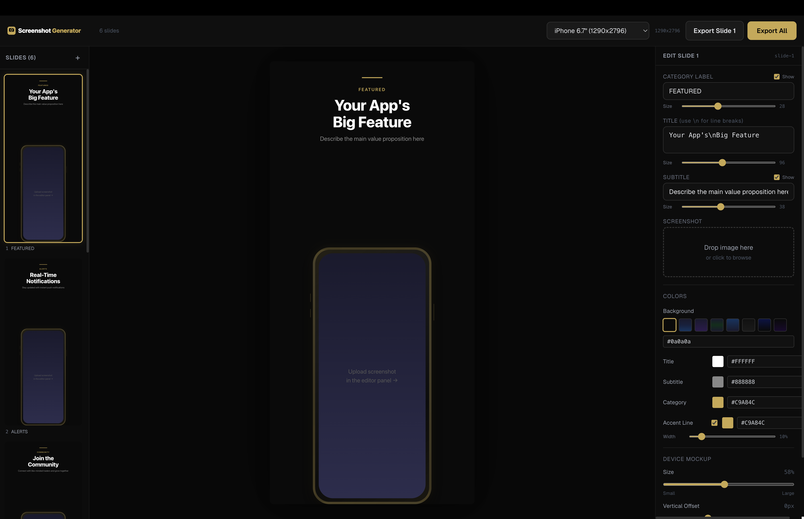

# iOS Screenshot Generator

Generate App Store screenshots for your iOS and iPad app — entirely in the browser. No design tools needed.

**Live Demo:** [https://ios-screenshot-generator.netlify.app](https://ios-screenshot-generator.netlify.app)

  



## Features

- **In-browser editor** — edit titles, colors, and upload screenshots without touching code
- **Drag & drop** screenshot upload per slide
- **4 Apple device targets** — iPhone 6.7", iPhone 6.5", iPad Pro 12.9", iPad Pro 11"
- **Pure CSS device mockups** — iPhone with gold frame, iPad with thin bezels (no image assets)
- **Per-slide customization:**
  - Category label (show/hide, adjustable font size)
  - Title with line breaks (adjustable font size)
  - Subtitle (show/hide, adjustable font size)
  - Accent line (show/hide, adjustable width and color)
  - Background color or gradient presets
  - Individual color pickers for title, subtitle, category
  - Device mockup size and vertical position sliders
- **Export single slide** or **Export All** as PNGs at exact Apple resolutions
- **Filenames auto-prefixed** with `iphone-` or `ipad-`
- **Dark professional UI** with gold accents
- **Slide management** — add, delete, reorder slides

## Live Demo

Try it now: **[ios-screenshot-generator.netlify.app](https://ios-screenshot-generator.netlify.app)**

## Quick Start (Local)

```bash
git clone https://github.com/jonpecson/ios-screenshot-generator.git
cd ios-screenshot-generator
npm install
npm run dev
```

Open [http://localhost:3000](http://localhost:3000)

## How to Use

### 1. Upload screenshots

Click or drag & drop your app screenshots into the **Screenshot** area in the right editor panel. Each slide has its own screenshot.

### 2. Edit text & colors

Use the editor panel to customize each slide:
- **Category Label** — small uppercase text above the title (e.g. "COMMUNITY")
- **Title** — big headline (use `\n` for line breaks)
- **Subtitle** — description text below the title
- Adjust **font sizes** with sliders
- Pick **background** from gradient presets or enter a custom CSS color/gradient
- Toggle **accent line** and adjust its width

### 3. Adjust device mockup

Use the **Device Mockup** section to:
- Resize the phone/iPad frame (30%–90% of slide width)
- Adjust vertical position (-200px to +400px)

### 4. Choose device

Select your target device from the dropdown:
- iPhone 6.7" (1290 × 2796)
- iPhone 6.5" (1284 × 2778)
- iPad Pro 12.9" (2048 × 2732)
- iPad Pro 11" (1668 × 2388)

### 5. Export

- **Export Slide N** — exports only the currently selected slide
- **Export All** — exports all slides sequentially

Files are named `iphone-screenshot-1.png` or `ipad-screenshot-1.png` automatically.

## Export Resolutions

| Device | Resolution | Type |
|--------|-----------|------|
| iPhone 6.7" (15 Pro Max, 14 Pro Max) | 1290 × 2796 | Phone |
| iPhone 6.5" (14 Plus, 13 Pro Max) | 1284 × 2778 | Phone |
| iPad Pro 12.9" | 2048 × 2732 | Tablet |
| iPad Pro 11" | 1668 × 2388 | Tablet |

## Project Structure

```
├── screenshots.config.ts         # Default slide configuration
├── public/
│   └── images/logo.svg           # Editor UI logo
├── app/
│   ├── page.tsx                  # 3-column editor layout
│   └── components/
│       ├── SlideList.tsx          # Left panel — slide thumbnails
│       ├── SlidePreview.tsx       # Center — live preview at full resolution
│       ├── SlideEditor.tsx        # Right panel — edit controls
│       ├── PhoneMockup.tsx        # CSS iPhone frame
│       ├── iPadMockup.tsx         # CSS iPad frame
│       ├── DeviceSelector.tsx     # Device dropdown
│       └── ExportEngine.tsx       # Export logic (html-to-image)
```

## Tech Stack

- [Next.js 16](https://nextjs.org/) with App Router
- [Tailwind CSS](https://tailwindcss.com/)
- [html-to-image](https://github.com/bubkoo/html-to-image) for PNG export
- TypeScript
- Static export (deployable to any CDN)

## Deploy Your Own

[](https://app.netlify.com/start/deploy?repository=https://github.com/jonpecson/ios-screenshot-generator)

Or manually:

```bash
npm run build   # outputs to /out
# Deploy the /out folder to any static host
```

## License

MIT + Commons Clause — free to use, modify, and share. Cannot be sold as a product or service.

## Author

[John Pecson](https://github.com/jonpecson)
